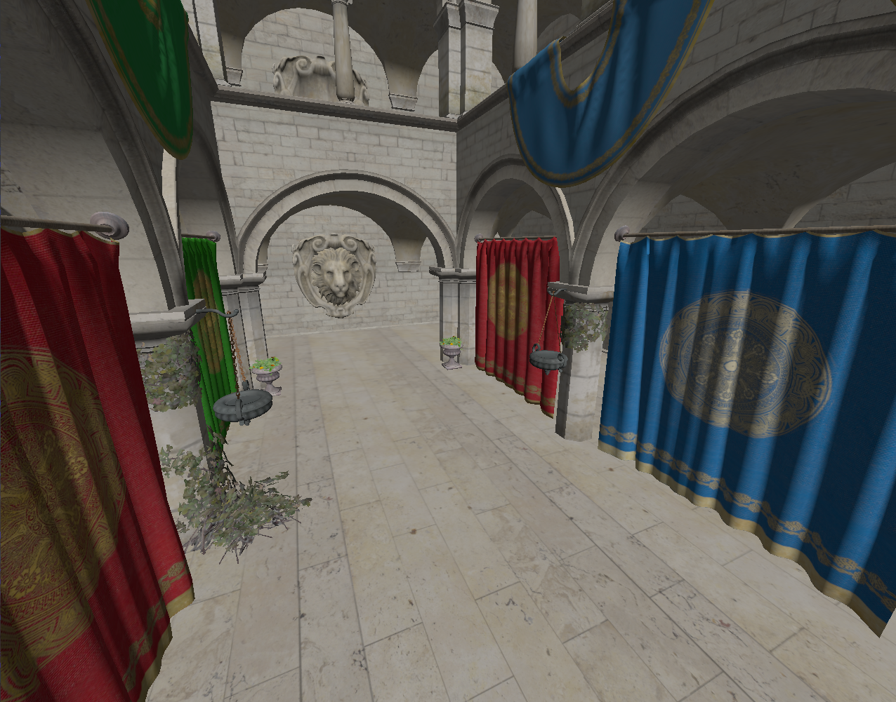

# wgltf

Testing gltf rendering with wgpu

It's a minimal example of rendering static gltf geometry and covering most of edge cases with image formats and primitive layouts.

## References

[Efficiently rendering glTF models A WebGPU Case Study](https://toji.github.io/webgpu-gltf-case-study/#textures)
